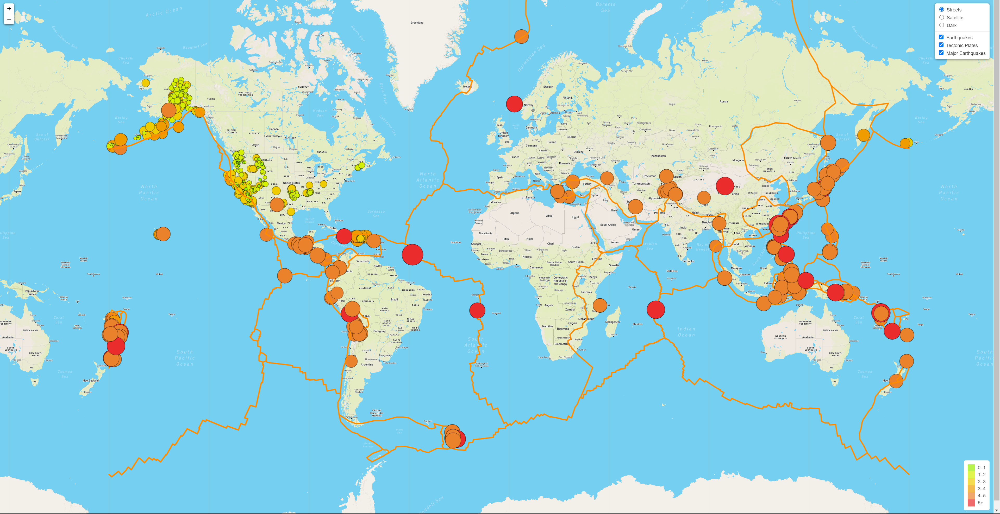

# Mapping_Earthquakes
## Module 13 [Map Visual Here](https://kdotghai.github.io/Mapping_Earthquakes/)

## OverView
     The utilization of maps allows us to explore, understand, and make decisions about our world in real time based upon stored data of the past event in databases/API’s. In this repository we will use javascript (GeoJSON) to create interactive maps to visualize earthquake data. GeoJSON data can be found in many apps that have a map feature such as ride-sharing, navigation, food and package delivery services, and even topography. While also providing location services on smart phones, tablets, laptops, any smart device that can display GeoSJON format/data. Essentially, this was the purpose of this project, to create easily digestible visuals with some aspects changing it via filters.

## Results
    Each earthquake is visually represented by a circle and color, where a higher magnitude will have a larger diameter and will be darker in color. In addition, each earthquake has a popup marker that, when clicked, shows the magnitude of the earthquake and the location of the earthquake. The map has three views:
-	# Street View  
  
 	
-	# Satellite View  
  
-	# Dark View  
  

## Summary
&nbsp;&nbsp;&nbsp;&nbsp; MapBox, a company that providees custom maps for websites and applications, supplies APIs that will be used to create interactive maps. Using these APIs in combination with the Leaflet JavaScript library, enables easy and highly customizable map creation. The earthquake data was collected from the U.S. Geological Survey website containing data from earthquakes worldwide over the past week. This data was extracted and loaded as a GeoJSON file, a type of JSON data specifically designed to hold geographical information. The final map contained the earthquake data represented as circular markers with their size and color corresponding to the magnitude of the earthquake. Each marker also has a popup that displays the magnitude and location of the earthquake. The map also contains multiple viewing layers (i.e. satellite, street) and the ability to toggle visibility of the earthquake data.
